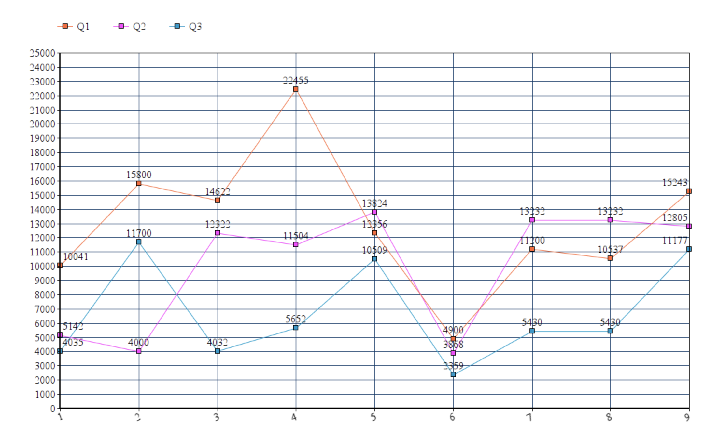
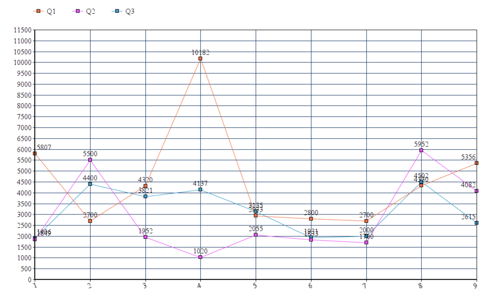
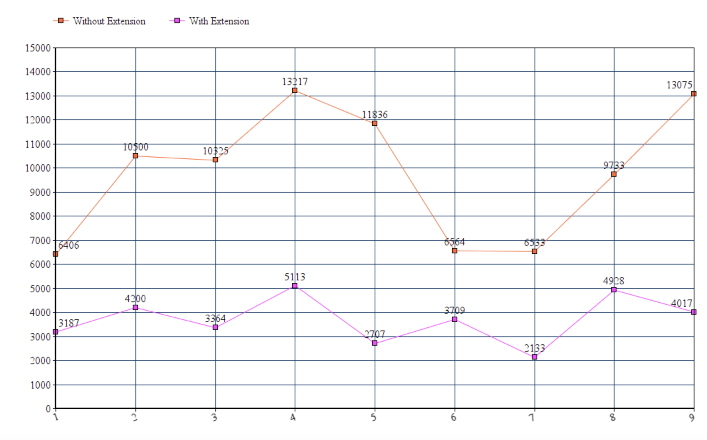

# EXPERIMENT

We basically devised three situations wherein the subjects had to perfom various convertions from one unit to another.
In each experiment the conversion had to be done once without using our extension and then again using the extension.

Next, we did a thorough analysis of the time taken by each subject for every experiment. The time in each case was noted and the following graphs were obtained.

## EXPERIMENT 1

Your birthday is coming up and you want to throw a party. Your friends are very enthusiastic about your birthday and are visiting you from California. At the same time your friends are annoyingly picky about certain things and they don’t miss any chance to trouble you. You have to throw them a party and you are searching for suitable areas in the neighborhood. Now, your friends have maintained the following restrictions:
They will directly travel from RDU to the party destination
They want the party place to be as close as possible to 30 kms
The place has to be reachable in around 1500 secs (annoyingly picky right!)

You have the following four areas shortlisted. Select one best suited area in each case.

Case 1: Without extension

[Braggtown](https://www.google.com/maps/dir/RDU/braggtown/@35.9485453,-78.9032546,12z/data=!3m1!4b1!4m13!4m12!1m5!1m1!1s0x89acf0fa028e79cf:0xe38392d241f375ed!2m2!1d-78.7879963!2d35.880079!1m5!1m1!1s0x89ace3a458f358c3:0xbf6b3d7927a42e85!2m2!1d-78.8919521!2d36.0348659)

[North hills](https://www.google.com/maps/dir/RDU+Airport,+John+Brantley+Boulevard,+Morrisville,+NC/North+Hills,+Raleigh,+NC/@35.859167,-78.7966819,12z/data=!3m1!4b1!4m13!4m12!1m5!1m1!1s0x89acf0fa028e79cf:0xe38392d241f375ed!2m2!1d-78.7879963!2d35.880079!1m5!1m1!1s0x89ac58a380e1be81:0x76cc263bdde0f7c2!2m2!1d-78.6422671!2d35.8395428)

Case 2: Using our extension

[Clayton](https://www.google.com/maps/dir/RDU/clayton/@35.7628116,-78.7764443,11z/am=t/data=!3m1!4b1!4m13!4m12!1m5!1m1!1s0x89acf0fa028e79cf:0xe38392d241f375ed!2m2!1d-78.7879963!2d35.880079!1m5!1m1!1s0x89ac5e7ec3b55aff:0x141ffd11bcfef2f6!2m2!1d-78.4563914!2d35.650711)

[Chapel hill](https://www.google.com/maps/dir/RDU/Chapel+Hill,+North+Carolina/@35.9058109,-78.9925546,12z/am=t/data=!3m1!4b1!4m13!4m12!1m5!1m1!1s0x89acf0fa028e79cf:0xe38392d241f375ed!2m2!1d-78.7879963!2d35.880079!1m5!1m1!1s0x89acc31c216e7ea7:0x7f03bae00443e4cb!2m2!1d-79.0558445!2d35.9131996)

## EXPERIMENT 2

You want to gift a refrigerator to your parents in India from the following page. The price of the refrigerator should not be more than 350 US dollars and the height should not be more than 5 ft as it may not fit well.

[Refrigerator](https://www.amazon.in/dp/B08448TTJM/ref=sspa_dk_detail_1?psc=1&pd_rd_i=B08448TTJM&pd_rd_w=felNw&pf_rd_p=1801b34c-8af9-42b5-8961-11f124edc99b&pd_rd_wg=eEyzP&pf_rd_r=6707SWB945XFP1K3ZPD6&pd_rd_r=a0592923-7de5-424b-b4ab-47d9c8e919b8&spLa=ZW5jcnlwdGVkUXVhbGlmaWVyPUEzTDhQVzQ3SVYxMTkyJmVuY3J5cHRlZElkPUEwNzg4OTMyMkxJSkgwNUkzT0Y2QyZlbmNyeXB0ZWRBZElkPUEwMTgxMjIyMVlaNVJRSTlFRkhZMCZ3aWRnZXROYW1lPXNwX2RldGFpbCZhY3Rpb249Y2xpY2tSZWRpcmVjdCZkb05vdExvZ0NsaWNrPXRydWU=)

Without using our extension, determine whether this refrigerator meets your specifications.

[Refrigerator2](https://www.amazon.in/Panasonic-Inverter-Refrigerator-NR-TBG27VSS3-Vegetable/dp/B0861TMVSH/ref=pd_di_sccai_5/257-3499946-1939813?_encoding=UTF8&pd_rd_i=B0861TMVSH&pd_rd_r=d056ff08-0e6b-4068-bf19-aa0b8e1def82&pd_rd_w=V9MUT&pd_rd_wg=RnTZb&pf_rd_p=a1f3aa5a-f05d-4e2d-b84b-6ef88e21fb7e&pf_rd_r=74PRKKF3PZSCTEJ0A74D&psc=1&refRID=74PRKKF3PZSCTEJ0A74D)

Use our extension to determine whether this refrigerator meets the same specifications.

## EXPERIMENT 3

You want to buy a new laptop and have shortlisted one that you like. Now, you want to check its specifications to see if it is a good fit for you. You have two desired specifications:
Laptop weight should be less than 2 Kilograms
Laptop screen size should be less than 36 centimetres.

Your shortlisted laptop is: [Lenovo yoga](https://www.amazon.com/2019_Lenovo-Touch-Screen-Processor-Graphics-Fingerprint/dp/B07MQDPPM5/ref=sr_1_6?dchild=1&keywords=lenovo+yoga+15+inches&qid=1605028510&sr=8-6)

Without using our extension, determine whether this laptop meets your specifications.

You have another shortlisted laptop: [ASUS chromebook](https://www.amazon.com/ASUS-Touchscreen-Fingerprint-Magnesium-Alloy-C436FA-DS388T/dp/B083ZB9YQ6/ref=redir_mobile_desktop?ie=UTF8&aaxitk=Zix50mzJ1Z3.AKw.RPkQ9g&hsa_cr_id=9822695450001&ref_=sbx_be_s_sparkle_mcd_asin_2)

Use our extension to determine whether this laptop meets the same specifications.

## RESULTS

Graph Without using extension

Graph using extension

Comparison of Average time

## CONCLUSION

From each of above experiments we conclude that in each instance, the time to convert one unit to another was significantly less while using extention versus using any
other method. Also, each participant felt that the extention made the process significantly easy and they would prefer using it.
